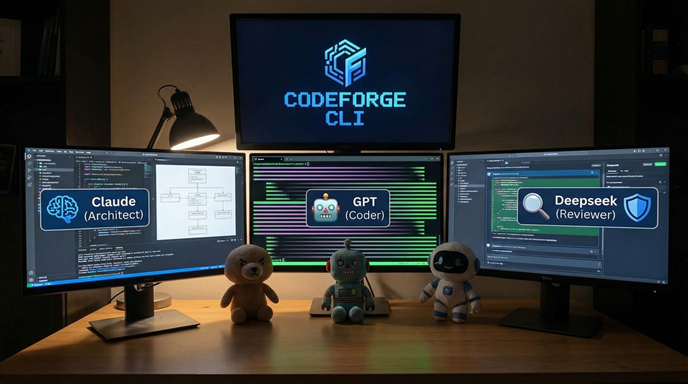

# Code Forge — CLI that orchestrates multiple LLM agents (Architect, Developer, Reviewer) to build production-ready code.

**AI-powered code analysis and development system using Claude/OpenAI/Deep-seek LLM.**

CodeForge is a command-line tool for code analysis and development using Large Language Models (LLM). It automates code reviews, architectural design, and component generation through an interactive workflow with roles: Architect, Developer, Reviewer.



## ❓ What is LLM?

**LLM (Large Language Model)** - AI neural network models that understand and generate text. CodeForge uses **Claude/OpenAI/Deep-seek** for:
- Code analysis and review
- System architecture design
- Automatic TypeScript code generation
- Quality and security checks

## 🎯 Two Modes

### REVIEW - Code Analysis
```bash
npm run dev -- review src/api.ts
```
Check code quality, security, and architecture.

### DEVELOP - Interactive Development
```bash
npm run dev -- develop monitoring-system \
  --requirements "Monitoring system for 1000+ hosts"
```
Automatic component creation: Architect → Developer → Reviewer → Approval.

---

## 🚀 Installation & Setup

### 1. Install Dependencies
```bash
npm install
```

### 2. Configure API Key
```bash
# Copy example
cp .env.example .env

# Add Claude API key
export ANTHROPIC_API_KEY=sk-ant-...
```

### 3. Run
```bash
npm run dev -- review src/app.ts
npm run dev -- develop my-project --requirements "Your requirements"
```

### 4. Build for Production
```bash
npm run build
```

---

## ⚙️ Configuration

### File: `edison.json`
```json
{
  "mode": "advanced",
  "roles": {
    "architect": {
      "model": "claude",
      "modelType": "claude-haiku-3-5",
      "temperature": 0.5,
      "maxTokens": 2048
    },
    "developer": {
      "model": "gpt",
      "modelType": "gpt-4-turbo",
      "temperature": 0.7,
      "maxTokens": 4096
    },
    "reviewer": {
      "model": "deepseek",
      "modelType": "deepseek-chat",
      "temperature": 0.3,
      "maxTokens": 2048
    }
  },
  "tools": {
    "enabled": ["read_file", "write_file", "test_runner", "code_search"],
    "securityRules": {
      "allowedPaths": ["./src", "./tests"],
      "forbiddenPaths": ["./.git", "./node_modules"]
    }
  }
}
```

### Environment Variables (.env)
```bash
ANTHROPIC_API_KEY=sk-ant-...
LOG_LEVEL=info              # debug, info, warn, error
EDISON_MODE=advanced         # simple, advanced
```

---

## 📋 Command Examples

```bash
# Simple code review
npm run dev -- review src/handler.ts

# Advanced review (all roles)
npm run dev -- review src/api.ts --mode advanced

# Development with requirements
npm run dev -- develop payment-system \
  --requirements "Payment processing API"

# Output as Markdown
npm run dev -- review src/app.ts --format markdown --output analysis.md

# Development mode with verbose logs
npm run dev -- develop service --requirements "..." --verbose
```

---

## 🧪 Testing

```bash
npm test              # Run tests
npm test -- --watch   # Watch mode
npm run type-check    # Type checking
```

---

## 📝 Project Structure

```
src/
├── cli/              # Command-line interface
├── models/           # LLM adapters (Claude, GPT, DeepSeek)
├── agents/           # Roles: Architect, Developer, Reviewer
├── config/           # Configuration loading
├── tools/            # Tools (read_file, write_file, etc.)
└── core/             # Core logic
```

---

## ❓ How to Run as Global Command (`codeforge`)?

To run `codeforge` instead of `npm run dev --`:

### Method 1: npm install -g (Recommended)
```bash
# In project folder
npm install -g .

# Now use anywhere:
codeforge review src/app.ts
codeforge develop system --requirements "..."
```

### Method 2: Add bin to package.json
Edit `package.json`:
```json
{
  "name": "edison-cli",
  "bin": {
    "codeforge": "./dist/cli/cli.js"
  }
}
```

Then:
```bash
npm install -g .
codeforge review src/app.ts
```

### Method 3: Create alias
```bash
# In .bashrc or .zshrc:
alias codeforge="npm run dev --"

# Reload shell
source ~/.bashrc
```

**I recommend Method 1** - the cleanest and most professional approach.

---

## 📄 License

MIT

---

Made for developers who care about code quality.
